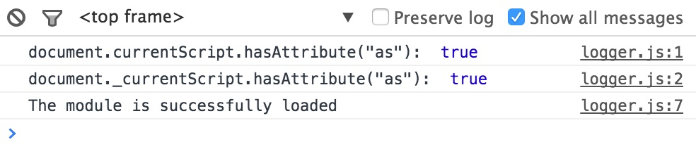
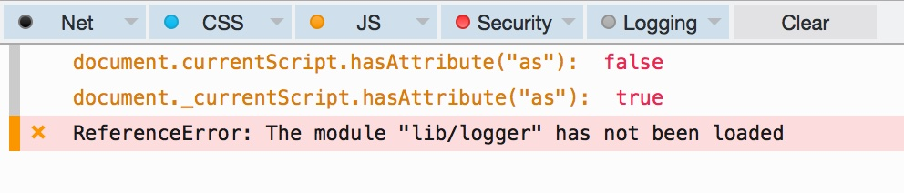

To start with the app install bower dependencies and launch a Web server of your choice inside the root directory of the project:

```sh
bower install
http-server
```

Open application in a Web browser.

In Google Chrome everything works fine:


In Firefox the module cannot be discovered because `document.currentScript` doesn't contain `as` attribute:

